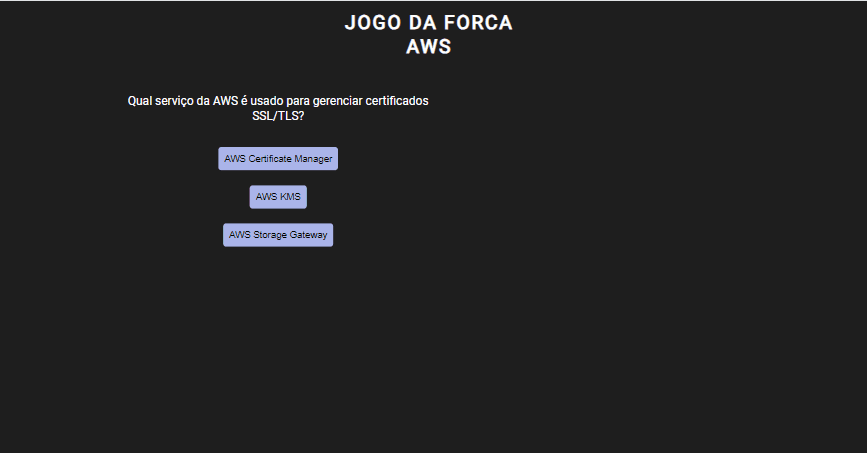
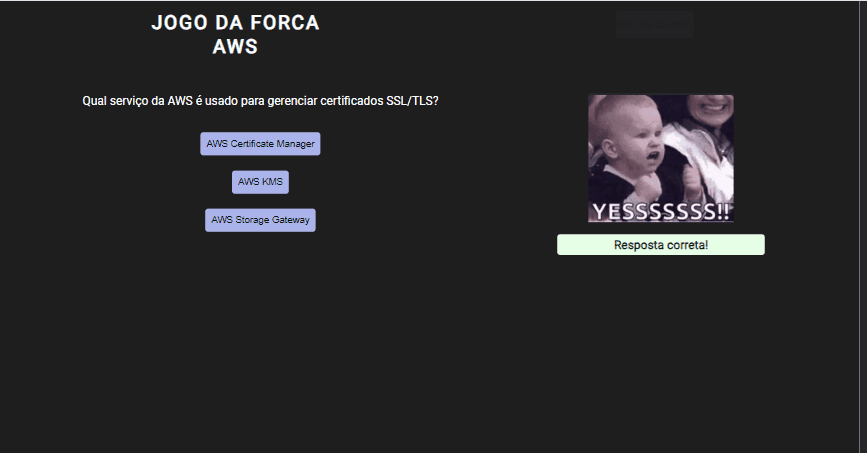

# JOGO DA FORCA - TEMA AWS
PARA TESTAR, [CLIQUE AQUI!](https://jessica-os.github.io/jogo-da-forca/)

 ## Veja como ficou o projeto:
 
 ## Desktop:
  
  
  ## Mobile:
 
   
  ## Do que se trata esse projeto?
A idéia deste jogo surgiu após dias intensos de estudo para a certificação AWS CLOUD PRACTITIONER. 
 E, para distrair um pouco mas sem perder o foco nos estudos, resolvi criar um jogo onde se pratica os temas que caem na prova da certificação, 
 mas de um jeito mais divertido. E de quebra, pude voltar a praticar HTML, CSS e JAVASCRIPT.

## Quais interações são realizadas?
- O usuário deve escolher uma das alternativas para a resposta da pergunta em questão.
- Após o acerto da questão, é possível passar para a próxima clicando em um botão.
- Se errar, o bonequinho da forca vai se desenhando e se completar o corpo inteiro, o jogo é perdido.
  
## Habilidades desenvolvidas:
- Uso de flexbox para ajustes dos elementos na tela.
- Uso e manipulação dos elementos no JavaScript.
- Uso de lógica para aparição das imagens, conforme acerto ou erro.
- Uso de mediaqueries para responsividade.

## Linguagens Utilizadas:
- HTML 

- CSS  

- JAVASCRIPT  
          

## Próximos passos:
Esta é a primeira versão do jogo, pretendo adicionar mais funcionalidades como:
- O usuário ter apossibilidade de voltar e avançar as questões.
- Adicionar explicação referente a resposta.

